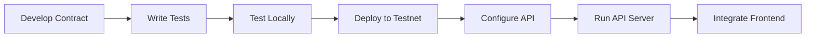

<div align="center">

# 🔢 Counter App - Blockchain Project

**A Production-Ready Full-Stack Blockchain Application**

[](https://soliditylang.org/)
[](https://hardhat.org/)
[](https://www.typescriptlang.org/)
[](https://nodejs.org/)
[](https://expressjs.com/)
[](https://viem.sh/)

*A modern blockchain application featuring a Counter smart contract and RESTful API server*

[Features](#-features) • [Quick Start](#-quick-start) • [Documentation](#-documentation) • [Tech Stack](#-tech-stack)

---

</div>

## 📋 Table of Contents

- [Overview](#-overview)
- [Features](#-features)
- [Project Architecture](#-project-architecture)
- [Folder Structure](#-folder-structure)
- [Quick Start](#-quick-start)
- [Usage Guide](#-usage-guide)
- [API Documentation](#-api-documentation)
- [Testing](#-testing)
- [Tech Stack](#-tech-stack)
- [Project Workflow](#-project-workflow)
- [Security](#-security)
- [Documentation](#-documentation)
- [Contributing](#-contributing)
- [License](#-license)

---

## 🎯 Overview

**Counter App** is a comprehensive blockchain application that demonstrates best practices in smart contract development, testing, and API integration. The project consists of two main components working together to provide a complete blockchain solution.

### What This Project Does

- ✅ **Smart Contract Development**: Production-ready Counter contract with increment/decrement functionality, access control, and comprehensive events
- ✅ **RESTful API**: Type-safe API server for interacting with deployed contracts
- ✅ **Comprehensive Testing**: Dual testing framework (Solidity + TypeScript) with 13 passing tests
- ✅ **Multi-Network Support**: Deploy to local networks or Sepolia testnet
- ✅ **Modern Tooling**: Built with Hardhat, Viem, TypeScript, and Express
- ✅ **Access Control**: Owner-only administrative functions for enhanced security
- ✅ **Enhanced Events**: Comprehensive event system for off-chain monitoring

---

## ✨ Features

### 🔷 Smart Contract Features

| Feature | Description |
|---------|-------------|
| **Increment Operations** | Increment counter by 1 or custom amount |
| **Decrement Operations** | Decrement counter by 1 or custom amount with underflow protection |
| **Access Control** | Owner-only functions for administrative tasks (reset, setValue, storeData) |
| **Event Emission** | Enhanced events (Increment, Decrement, DataStored, OwnershipTransferred, CounterReset) |
| **Public State** | Counter value is publicly readable |
| **Safety Checks** | Built-in protection against underflow and overflow errors |
| **Ownership Management** | Transfer ownership functionality with event tracking |
| **NatSpec Documentation** | Comprehensive documentation for all functions and events |

### 🔷 API Server Features

| Feature | Description |
|---------|-------------|
| **RESTful Endpoints** | Clean, intuitive API for contract interactions |
| **Type Safety** | Full TypeScript support with Viem for type-safe calls |
| **CORS Support** | Ready for frontend integration |
| **Environment Config** | Flexible configuration via environment variables |
| **Error Handling** | Comprehensive error handling and responses |

### 🔷 Development Features

| Feature | Description |
|---------|-------------|
| **Dual Testing** | Solidity unit tests + TypeScript integration tests |
| **Hardhat Ignition** | Modern deployment system with module support |
| **Multi-Network** | Support for local development and testnet deployment |
| **Type Safety** | End-to-end TypeScript for type-safe development |
| **Hot Reload** | Development mode with auto-reload for faster iteration |

---

## 🏗️ Project Architecture

```
┌─────────────────────────────────────────────────────────────┐
│                    Counter App Architecture                   │
└─────────────────────────────────────────────────────────────┘

┌──────────────────┐         ┌──────────────────┐
│   Smart Contract │         │   API Server     │
│   (Hardhat)      │◄────────┤   (Express)      │
│                  │         │                  │
│  • Counter.sol   │         │  • REST API      │
│  • Tests         │         │  • TypeScript    │
│  • Deployment    │         │  • Viem Client   │
└────────┬─────────┘         └────────┬─────────┘
         │                            │
         └────────────┬───────────────┘
                      │
         ┌────────────▼────────────┐
         │   Ethereum Network      │
         │  (Local/Sepolia/Main)  │
         └─────────────────────────┘
```

### Component Overview

<div align="center">

| Component | Technology | Purpose |
|:---------:|:----------:|:--------|
| **Smart Contract** | Solidity 0.8.28 | On-chain counter logic |
| **Development** | Hardhat 3.1.3 | Compile, test, deploy |
| **API Server** | Express + TypeScript | RESTful interface |
| **Ethereum Client** | Viem 2.44.1 | Type-safe blockchain interactions |
| **Testing** | Foundry + Node.js | Comprehensive test coverage |

</div>

---

## 📂 Folder Structure

```
counter-app/
│
├── 📄 .gitignore              # Git ignore rules
├── 📄 README.md               # Project documentation (this file)
│
├── 📁 hardhat/                # Smart Contract Project
│   ├── 📁 contracts/          # Solidity source files
│   │   ├── 📄 Counter.sol     # Main Counter contract
│   │   └── 📄 Counter.t.sol    # Solidity unit tests
│   │
│   ├── 📁 test/               # TypeScript integration tests
│   │   └── 📄 Counter.ts       # Contract integration tests
│   │
│   ├── 📁 scripts/            # Deployment & utility scripts
│   │   ├── 📄 deploy.ts       # View deployed addresses
│   │   └── 📄 send-op-tx.ts   # Utility scripts
│   │
│   ├── 📁 ignition/           # Hardhat Ignition deployment
│   │   ├── 📁 modules/        # Deployment modules
│   │   │   └── 📄 Counter.ts  # Counter deployment module
│   │   └── 📁 deployments/    # Deployment artifacts (gitignored)
│   │
│   ├── 📁 artifacts/          # Compiled contracts (gitignored)
│   ├── 📁 cache/              # Hardhat cache (gitignored)
│   │
│   ├── ⚙️ hardhat.config.ts   # Hardhat configuration
│   ├── 📦 package.json        # Dependencies & scripts
│   ├── ⚙️ tsconfig.json       # TypeScript configuration
│   └── 📖 README.md           # Hardhat documentation
│
└── 📁 api/                    # API Server Project
    ├── 📁 src/                # Source code
    │   └── 📄 server.ts        # Main API server
    │
    ├── 📁 node_modules/       # Dependencies (gitignored)
    │
    ├── 📦 package.json         # Dependencies & scripts
    ├── ⚙️ tsconfig.json        # TypeScript configuration
    └── 📖 README.md            # API documentation
```

### 📌 Key Directories

<details>
<summary><b>Click to expand directory details</b></summary>

#### Root Level
- **`.gitignore`** - Excludes `node_modules`, build artifacts, `.env` files, IDE configs
- **`README.md`** - Main project documentation

#### `hardhat/` Directory
- **`contracts/`** - Solidity smart contract source files
- **`test/`** - TypeScript integration tests using Node.js test runner
- **`scripts/`** - Deployment scripts and utilities
- **`ignition/`** - Hardhat Ignition deployment configuration
- **`artifacts/`** - Compiled contract artifacts (auto-generated, gitignored)
- **`cache/`** - Hardhat build cache (gitignored)

#### `api/` Directory
- **`src/`** - TypeScript source code
- **`node_modules/`** - npm dependencies (gitignored)

</details>

---

## 🚀 Quick Start

### Prerequisites

Before you begin, ensure you have the following installed:

| Requirement | Version | Installation |
|:-----------:|:-------:|:------------:|
| **Node.js** | >= 18.x | [Download](https://nodejs.org/) |
| **npm** | Latest | Comes with Node.js |
| **Git** | Latest | [Download](https://git-scm.com/) |

### Installation Steps

#### 1️⃣ Clone the Repository

```bash
git clone <your-repo-url>
cd counter-app
```

#### 2️⃣ Install Hardhat Dependencies

```bash
cd hardhat
npm install
cd ..
```

#### 3️⃣ Install API Dependencies

```bash
cd api
npm install
cd ..
```

#### 4️⃣ Configure Environment Variables

**For Hardhat** (`hardhat/.env`):

```env
# Sepolia Testnet Configuration
SEPOLIA_RPC_URL=https://sepolia.infura.io/v3/YOUR_API_KEY
SEPOLIA_PRIVATE_KEY=0xYOUR_PRIVATE_KEY
```

**For API** (`api/.env`):

```env
# RPC Configuration
RPC_URL=https://sepolia.infura.io/v3/YOUR_API_KEY
# Or use SEPOLIA_RPC_URL
SEPOLIA_RPC_URL=https://sepolia.infura.io/v3/YOUR_API_KEY

# Private Key
SEPOLIA_PRIVATE_KEY=0xYOUR_PRIVATE_KEY

# Contract Address (set after deployment)
CONTRACT_ADDRESS=0xYourDeployedContractAddress

# Server Configuration
PORT=3000
NETWORK=sepolia
```

> ⚠️ **Security Warning**: Never commit `.env` files or private keys to version control!

---

## 📖 Usage Guide

### 🔷 Deploy Smart Contract

#### Step 1: Navigate to Hardhat Directory

```bash
cd hardhat
```

#### Step 2: Compile Contracts

```bash
npm run compile
# or
npx hardhat compile
```

#### Step 3: Deploy to Sepolia Testnet

```bash
npm run deploy
# or
npx hardhat ignition deploy ignition/modules/Counter.ts --network sepolia --reset
```

#### Step 4: Get Deployed Contract Address

```bash
npx hardhat run scripts/deploy.ts
```

This will display the deployed contract address. Copy it for the API configuration.

### 🔷 Run API Server

#### Step 1: Navigate to API Directory

```bash
cd api
```

#### Step 2: Update Environment Variables

Edit `api/.env` and set the `CONTRACT_ADDRESS` with the address from deployment:

```env
CONTRACT_ADDRESS=0xYourDeployedContractAddress
```

#### Step 3: Start the Server

**Production Mode:**
```bash
npm start
```

**Development Mode (with auto-reload):**
```bash
npm run dev
```

#### Step 4: Verify Server is Running

The API will be available at:
```
http://localhost:3000
```

Test the health endpoint:
```bash
curl http://localhost:3000/health
```

---

## 📡 API Documentation

### Base URL

```
http://localhost:3000
```

### Endpoints

| Method | Endpoint | Description | Request Body | Response |
|:------:|:--------:|:-----------|:------------:|:--------:|
| **GET** | `/health` | Health check | - | `{ "status": "ok" }` |
| **GET** | `/value` | Get current counter value | - | `{ "success": true, "value": "5" }` |
| **POST** | `/increment` | Increment counter by 1 | - | `{ "success": true, "transactionHash": "0x...", "blockNumber": "12345678", "status": "success" }` |
| **POST** | `/increment-by` | Increment by custom amount | `{ "amount": 10 }` | `{ "success": true, "transactionHash": "0x...", "blockNumber": "12345678", "status": "success", "amount": 10 }` |

### Example Requests

<details>
<summary><b>Click to see example requests</b></summary>

#### Get Current Value

```bash
curl http://localhost:3000/value
```

**Response:**
```json
{
  "success": true,
  "value": "5"
}
```

#### Increment by 1

```bash
curl -X POST http://localhost:3000/increment
```

**Response:**
```json
{
  "success": true,
  "transactionHash": "0x1234567890abcdef...",
  "blockNumber": "12345678",
  "status": "success"
}
```

#### Increment by Amount

```bash
curl -X POST http://localhost:3000/increment-by \
  -H "Content-Type: application/json" \
  -d '{"amount": 10}'
```

**Response:**
```json
{
  "success": true,
  "transactionHash": "0x1234567890abcdef...",
  "blockNumber": "12345678",
  "status": "success",
  "amount": 10
}
```

</details>

---

## 🧪 Testing

### Test Smart Contracts

```bash
cd hardhat
npm test
```

This runs both Solidity and TypeScript tests.

**Run only Solidity tests:**
```bash
npx hardhat test solidity
```

**Run only TypeScript tests:**
```bash
npx hardhat test nodejs
```

### Test API Endpoints

Once the API server is running, you can test endpoints using:

- **cURL** (command line)
- **Postman** (GUI tool)
- **Browser** (for GET requests)
- **JavaScript/TypeScript** (fetch API)

See [API Documentation](#-api-documentation) for detailed examples.

---

## 🛠️ Tech Stack

### Smart Contract Stack

<div align="center">

| Technology | Version | Purpose |
|:---------:|:-------:|:--------|
|  | `^0.8.28` | Smart contract language |
|  | `^3.1.3` | Development environment |
|  | `~5.8.0` | Type-safe JavaScript |
|  | `^2.44.1` | Ethereum TypeScript library |
|  | `^3.0.6` | Deployment system |

</div>

### API Server Stack

<div align="center">

| Technology | Version | Purpose |
|:---------:|:-------:|:--------|
|  | `>= 18.x` | Runtime environment |
|  | `^5.2.1` | Web framework |
|  | `~5.8.0` | Type-safe JavaScript |
|  | `^2.44.1` | Ethereum client |
|  | `^2.8.5` | Cross-origin resource sharing |

</div>

---

## 📝 Project Workflow



### Development Flow

1. **📝 Develop & Test** - Write and test smart contracts in `hardhat/`
2. **🚀 Deploy** - Deploy contracts to testnet/mainnet
3. **⚙️ Configure** - Set up API server with contract address
4. **▶️ Run** - Start API server to interact with deployed contracts
5. **🔗 Integrate** - Connect frontend applications with the API

---

## 🔒 Security

<div align="center">

### ⚠️ Important Security Guidelines

</div>

| Guideline | Description |
|:---------:|:-----------|
| 🔐 **Never Commit Secrets** | Never commit `.env` files or private keys to version control |
| 🧪 **Use Testnet** | Always use testnet for development and testing |
| 🔑 **Secure Keys** | Keep private keys secure and never share them |
| ✅ **Verify Contracts** | Verify smart contracts on block explorers |
| 🛡️ **Audit Code** | Consider professional audits for production contracts |

### Security Best Practices

- ✅ Use environment variables for sensitive data
- ✅ Implement proper access controls in contracts
- ✅ Test thoroughly before mainnet deployment
- ✅ Use multi-sig wallets for contract ownership
- ✅ Keep dependencies up to date

---

## 📚 Documentation

### Project Documentation

- 📖 **[Hardhat Project Documentation](./hardhat/README.md)** - Detailed smart contract documentation
- 📖 **[API Server Documentation](./api/README.md)** - Complete API reference

### External Resources

- [Hardhat Documentation](https://hardhat.org/docs)
- [Viem Documentation](https://viem.sh/)
- [Solidity Documentation](https://docs.soliditylang.org/)
- [Express Documentation](https://expressjs.com/)

---

## 🤝 Contributing

We welcome contributions! Here's how you can help:

### Contribution Guidelines

1. **Fork the repository**
2. **Create a feature branch** (`git checkout -b feature/amazing-feature`)
3. **Make your changes** and write tests
4. **Commit your changes** (`git commit -m 'Add some amazing feature'`)
5. **Push to the branch** (`git push origin feature/amazing-feature`)
6. **Open a Pull Request**

### Development Guidelines

- ✅ Follow Solidity style guide conventions
- ✅ Write tests for new features
- ✅ Ensure all tests pass before submitting PR
- ✅ Update documentation as needed
- ✅ Use meaningful commit messages

---

## 📄 License

This project is licensed under the **UNLICENSED** license.

---

<div align="center">

### ⭐ If you found this project helpful, please consider giving it a star!

---

**Built with ❤️ using Hardhat, Viem, and Express**

[⬆ Back to Top](#-counter-app---blockchain-project)

</div>
